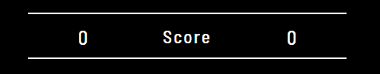
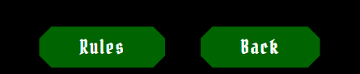

# A Fighting Chance

Image

A Fighting Chance is a Rock, Paper, Scissors, Lizard, Spock game but with a Monty Python and the Holy Grail Theme, which in itself is also an extension of the classic game of chance, Rock Paper Scissors. Rock, Paper, Scissors, Lizard, Spock was mentioned in *The Times* of London in 2005 and was later the subject of an episode of the American sitcom *The Big Bang Theory* in 2008, and *Monty Python and the Holy Grail* is a British comedy movie made in 1975.

This website is originally supposed to be a mobile game where the Black Knight (from the movie) challenges you to the Mobile game itself, in vengance after loosing to King Arthur in the movie. You will see (on bigger screens) the Black Knight facing you off for the challenege with your phone infront of you depicting the scene of what is happeneing. The game itself is a game of pure chance where you choose your desired Knight and the Black Knight (computer) chooses a random Knight. From the specific rules of the game, one will beat the other or end in a draw. You also have the option to choose your name before the game begins.

Visit the deployed website [here](https://serjosh.github.io/a-fighting-chance/).

## Table of Contents

- [A Fighting Chance](#a-fighting-chance)
  - [Table of Contents](#table-of-contents)
  - [User Experience (UX)](#user-experience-ux)
    - [Project Goals](#project-goals)
    - [User Stories](#user-stories)
    - [Color Scheme](#color-scheme)
    - [Typography](#typography)
    - [Wireframes](#wireframes)
  - [Features](#features)
    - [General](#general)
    - [Landing Page](#landing-page)
    - [Game Page](#game-page)
    - [How to Play](#how-to-play)
    - [About the Game](#about-the-game)
    - [Rules](#rules)
    - [GIFs](#gifs)
  - [Technologies Used](#technologies-used)
    - [Languages Used](#languages-used)
    - [Frameworks, Libraries and Programs Used](#frameworks-libraries-and-programs-used)
  - [Testing](#testing)
    - [Testing User Stories](#testing-user-stories)

## User Experience (UX)

### Project Goals

- The Game provides a structure that is easy to understand and navigate.

- Contains contrasting colours and interactivity to engage the player in the game.

- Game is made responsive to make the game accessible on different devices.

- Incorporates a How to Play, About the Game and Rules section that is easily accessible and informative to the player.

- A Name option is provided to let the player choose a name if desired to use in the game.

### User Stories

- As a player, I want the game to be easy to navigate.

- As a player, I want the game to be fun, entertaining and engaging.

- As a player, I want to have easy access to be informed on how to play.

- As a player, I want to have easy access to know more about the game.

- As a player, I want easy access to the rules of the game while playing.

- As a player, I want the game controls to be easily understandable during the game.

- As a player, I want the option to choose my name for the game.

- As a player, I want to be able to play the game on different devices.

### Color Scheme

The colors used in the site are black (#000000) and Forest/dark green (0C952A). It is a contrast of colours used throughout the Game, where the dark green is used for the buttons and hover effects and Black used for the background of the phone to make the other colours stand out. And of course all text in the colour of White (#FFFFFF) to stand out from the black used in the background.

The colors scheme is inspired by the forest where the battle of the Black Knight and King Arthur took place.

### Typography

The Fonts used are Pirata One, Barlow Semi Condensed and sans-serif which I chose myself. Pirata One was used in all headings for the medieval vibe in which the theme of the movie the game used took place, Barlow Semi Condensed used for the text in the Game for its simplicity and clarity and sans-serif used as back up if the others are unable to come up.

### Wireframes

[Balsamiq](https://balsamiq.com/) has been used to plan a structure of the appearance of the site and display the placement of the different elements in the game.

Obviously as you can see, the finished game does not look too much like the wireframes anymore. It was more of a guideline for how I originally wanted it to look in my head, and as i developed the project new and improved ideas came to me and I adjusted it accordingly.

[Back to top ⇧](#A Fighting Chance)

## Features

### General

- This game has been designed from a mobile first perspective.

- Responsive design across all device sizes.

- **Header**

  The header contains the game logo A Fighting Chance .

- **Background**

  
   A background of the Black Knight has been added to devices with screens 750px wide and up to add some context to the Game.

### Landing Page

- **Knight Images**
  

Displays images of all the knights displayed for you to see what you playing with.

- **Name input field**
  

Displays A text input for you to Put down any name you want to use in the game.

- **Landing Page Buttons**
  

A choice of buttons, Play, How to Play and About Us to go to the desired page from the Landing Page.

- **Landing Page Footer**
  

A footer to go to the desired social media platforms.

### Game Page

- **Game Page Buttons**
  

Game Buttons giving you the option of seeing the rules or going back to the Landing Page, resetting the game.

- **Game Zone before game**
  

Displays the game before the first knight is has been chosen, showing the Monty Python depicted God and the Black Knight, each with their own quotes from the movie.

- **Game Zone during game**
  

Displays the game during the first knight has been chosen, showing youe chosen knight, the opponents chosen knight and the knights names and if you beat them or lose, or even a draw.

- **Game Score**
  

Displays the score in which the score on the left is your score and the one on the right is the opponents score.

- **Knight Choice**
  

Displays the choice of Knights to choose from in which to use in the game, with a hover element of dark green on them.

### How to Play

- **How to Play text content and heading**
  

Displays the Heading and text content of the How to Play page, explaining how to play the game.

- **How to Play Knights**
  

Displays the Knights used in the game.

- **How to Play Buttons**
  

A list of Buttons. Back which goes back to the landing page and Rules, going to the rules page.

### About the Game

- **About the Game text content, image and heading**
  

Displays the Heading, image of the Black Knight and text content of the About the Game page, giving more insight into the game and what you are playing for and against.

- **About the Game Back button**
  

A Back button, taking you back to the landing page.

### Rules

- **Rules Back button**
  

A Back button, taking you back to either the landing page or the game page, depending where you clicked on the rules button (either the game page or how to play page).

- **Rules who beats who content**
  

A list of the ten variations of who beats who in the game.

### GIFs

- **GIF win result**
  

Displays a victorious GIF with the Heading, Winner.

- **GIF loose result**
  

Displays a loosing GIF with the Heading, Loose...

- **GIF Buttons**
  

A list of Buttons, Play Again and Exit. Play again takes you back to the game page, refreshing the page to play again, and the exit button takes you back to the landing page also refreshing the game page.

[Back to top ⇧](#A Fighting Chance)

## Technologies Used

### Languages Used

- [HTML5](https://en.wikipedia.org/wiki/HTML5)
- [CSS3](https://en.wikipedia.org/wiki/CSS)
- [Javascript](https://en.wikipedia.org/wiki/JavaScript)

### Frameworks, Libraries and Programs Used

- [Google Fonts](https://fonts.google.com/)
- Google Fonts was used to import the fonts of Pirata One and Barlow semi condensed into the style.css file. These fonts were used throughout the game.

- [Font Awesome](https://fontawesome.com/)
  - Font Awesome was used for the Footer icons used on the Landing Page.

- [Codeanywhere](https://gitpod.io/)
  - Codeabywhere was used for writing code, committing, and then pushing the project to GitHub.

- [GitHub](https://github.com/)
  - GitHub was used to store the project after pushing.
  
- [Balsamiq](https://balsamiq.com/)
  - Balsamiq was used to create the wireframes for the general beginning structure of the game.

- [Replit](https://replit.com/)
  - Replit was used for the beginning structures, designs, and experimental Javascript for the project before beginning them on Codeanywhere.

- [TinyPNG](https://tinypng.com/)
  - TinyPNG was used to condense the images used throughout the game to make the game load faster.

- [Am I Responsive?](http://ami.responsivedesign.is/#)
  - Am I Responsive was used in order to see responsive design throughout the process and to generate mockup imagery to be used.

- [Responsive Design Checker](https://www.responsivedesignchecker.com/)
  - Responsive Design Checker was used in the testing process to check responsiveness on various devices.

- [Chrome DevTools](https://developer.chrome.com/docs/devtools/)
  - Chrome DevTools was used during development process for code review and to test responsiveness.

- [W3C Markup Validator](https://validator.w3.org/)
  - W3C Markup Validator was used to validate the HTML code.

- [W3C CSS Validator](https://jigsaw.w3.org/css-validator/)
  - W3C CSS Validator was used to validate the CSS code.

- [JSHint](https://jshint.com/)
  - The JSHints JavaScript Code Quality Tool was used to validate the site's JavaScript code.

[Back to top ⇧](#A Fighting Chance)

## Testing

### Testing User Stories
