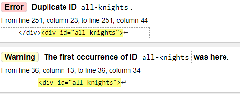

# A Fighting Chance

A Fighting Chance is a Rock, Paper, Scissors, Lizard, Spock game but with a Monty Python and the Holy Grail Theme, which in itself is also an extension of the classic game of chance, Rock Paper Scissors. Rock, Paper, Scissors, Lizard, Spock was mentioned in *The Times* of London in 2005 and was later the subject of an episode of the American sitcom *The Big Bang Theory* in 2008, and *Monty Python and the Holy Grail* is a British comedy movie made in 1975.

This website is originally supposed to be a mobile game where the Black Knight (from the movie) challenges you to the Mobile game itself, in vengance after loosing to King Arthur in the movie. You will see (on bigger screens) the Black Knight facing you off for the challenege with your phone infront of you depicting the scene of what is happeneing. The game itself is a game of pure chance where you choose your desired Knight and the Black Knight (computer) chooses a random Knight. From the specific rules of the game, one will beat the other or end in a draw. You also have the option to choose your name before the game begins.

Visit the deployed website [here](https://serjosh.github.io/a-fighting-chance/).

## Table of Contents

- [A Fighting Chance](#a-fighting-chance)
  - [Table of Contents](#table-of-contents)
  - [User Experience (UX)](#user-experience-ux)
    - [Project Goals](#project-goals)
    - [User Stories](#user-stories)
    - [Color Scheme](#color-scheme)
    - [Typography](#typography)
    - [Wireframes](#wireframes)
  - [Features](#features)
    - [General](#general)
    - [Landing Page](#landing-page)
    - [Game Page](#game-page)
    - [How to Play](#how-to-play)
    - [About the Game](#about-the-game)
    - [Rules](#rules)
    - [GIFs](#gifs)
  - [Technologies Used](#technologies-used)
    - [Languages Used](#languages-used)
    - [Frameworks, Libraries and Programs Used](#frameworks-libraries-and-programs-used)
  - [Testing](#testing)
    - [Testing User Stories](#testing-user-stories)
    - [Code Validation](#code-validation)
    - [Accessibility](#accessibility)
    - [Tools Testing](#tools-testing)
    - [Manual Testing](#manual-testing)
    - [Known Bugs](#known-bugs)
  - [Finished Product](#finished-product)
  - [Deployment](#deployment)
    - [GitHub Pages](#github-pages)
  - [Credits](#credits)
    - [Content](#content)
    - [Media](#media)
    - [Code](#code)
  - [Acknowledgements](#acknowledgements)

## User Experience (UX)

### Project Goals

- The Game provides a structure that is easy to understand and navigate.

- Contains contrasting colours and interactivity to engage the player in the game.

- Game is made responsive to make the game accessible on different devices.

- Incorporates a How to Play, About the Game and Rules section that is easily accessible and informative to the player.

- A Name option is provided to let the player choose a name if desired to use in the game.

### User Stories

- As a player, I want the game to be easy to navigate.

- As a player, I want the game to be fun, entertaining and engaging.

- As a player, I want to have easy access to be informed on how to play.

- As a player, I want to have easy access to know more about the game.

- As a player, I want easy access to the rules of the game while playing.

- As a player, I want the game controls to be easily understandable during the game.

- As a player, I want the option to choose my name for the game.

- As a player, I want to be able to play the game on different devices.

### Color Scheme

The colors used in the site are black (#000000) and Forest/dark green (0C952A). It is a contrast of colours used throughout the Game, where the dark green is used for the buttons and hover effects and Black used for the background of the phone to make the other colours stand out. And of course all text in the colour of White (#FFFFFF) to stand out from the black used in the background.

The colors scheme is inspired by the forest where the battle of the Black Knight and King Arthur took place.

### Typography

The Fonts used are Pirata One, Barlow Semi Condensed and sans-serif which I chose myself. Pirata One was used in all headings for the medieval vibe in which the theme of the movie the game used took place, Barlow Semi Condensed used for the text in the Game for its simplicity and clarity and sans-serif used as back up if the others are unable to come up.

### Wireframes

[Balsamiq](https://balsamiq.com/) has been used to plan a structure of the appearance of the site and display the placement of the different elements in the game.

Obviously as you can see, the finished game does not look too much like the wireframes anymore. It was more of a guideline for how I originally wanted it to look in my head, and as i developed the project new and improved ideas came to me and I adjusted it accordingly.

[Back to top](#a-fighting-chance)

## Features

### General

- This game has been designed from a mobile first perspective.

- Responsive design across all device sizes.

- **Header**

  The header contains the game logo A Fighting Chance .

- **Background**

  
   A background of the Black Knight has been added to devices with screens 750px wide and up to add some context to the Game.

### Landing Page

- **Knight Images**
  

Displays images of all the knights displayed for you to see what you playing with.

- **Name input field**
  

Displays A text input for you to Put down any name you want to use in the game.

- **Landing Page Buttons**
  

A choice of buttons, Play, How to Play and About Us to go to the desired page from the Landing Page.

- **Landing Page Footer**
  

A footer to go to the desired social media platforms.

### Game Page

- **Game Page Buttons**
  

Game Buttons giving you the option of seeing the rules or going back to the Landing Page, resetting the game.

- **Game Zone before game**
  

Displays the game before the first knight is has been chosen, showing the Monty Python depicted God and the Black Knight, each with their own quotes from the movie.

- **Game Zone during game**
  

Displays the game during the first knight has been chosen, showing youe chosen knight, the opponents chosen knight and the knights names and if you beat them or lose, or even a draw.

- **Game Score**
  

Displays the score in which the score on the left is your score and the one on the right is the opponents score.

- **Knight Choice**
  

Displays the choice of Knights to choose from in which to use in the game, with a hover element of dark green on them.

### How to Play

- **How to Play text content and heading**
  

Displays the Heading and text content of the How to Play page, explaining how to play the game.

- **How to Play Knights**
  

Displays the Knights used in the game.

- **How to Play Buttons**
  

A list of Buttons. Back which goes back to the landing page and Rules, going to the rules page.

### About the Game

- **About the Game text content, image and heading**
  

Displays the Heading, image of the Black Knight and text content of the About the Game page, giving more insight into the game and what you are playing for and against.

- **About the Game Back button**
  

A Back button, taking you back to the landing page.

### Rules

- **Rules Back button**
  

A Back button, taking you back to either the landing page or the game page, depending where you clicked on the rules button (either the game page or how to play page).

- **Rules who beats who content**
  

A list of the ten variations of who beats who in the game.

### GIFs

- **GIF win result**
  

Displays a victorious GIF with the Heading, Winner.

- **GIF loose result**
  

Displays a loosing GIF with the Heading, Loose...

- **GIF Buttons**
  

A list of Buttons, Play Again and Exit. Play again takes you back to the game page, refreshing the page to play again, and the exit button takes you back to the landing page also refreshing the game page.

[Back to top](#a-fighting-chance)

## Technologies Used

### Languages Used

- [HTML5](https://en.wikipedia.org/wiki/HTML5)
- [CSS3](https://en.wikipedia.org/wiki/CSS)
- [Javascript](https://en.wikipedia.org/wiki/JavaScript)

### Frameworks, Libraries and Programs Used

- [Google Fonts](https://fonts.google.com/)
- Google Fonts was used to import the fonts of Pirata One and Barlow semi condensed into the style.css file. These fonts were used throughout the game.

- [Font Awesome](https://fontawesome.com/)
  - Font Awesome was used for the Footer icons used on the Landing Page.

- [Codeanywhere](https://app.codeanywhere.com/)
  - Codeabywhere was used for writing code, committing, and then pushing the project to GitHub.

- [GitHub](https://github.com/)
  - GitHub was used to store the project after pushing.
  
- [Balsamiq](https://balsamiq.com/)
  - Balsamiq was used to create the wireframes for the general beginning structure of the game.

- [Google](https://google.com/)
  - Google was used often for images, sites for information and use in the project. 

- [Replit](https://replit.com/)
  - Replit was used for the beginning structures, designs, and experimental Javascript for the project before beginning them on Codeanywhere.

- [TinyPNG](https://tinypng.com/)
  - TinyPNG was used to condense the images used throughout the game to make the game load faster.

- [Am I Responsive?](http://ami.responsivedesign.is/#)
  - Am I Responsive was used to see responsive design of the Game.

- [Responsive Design Checker](https://www.responsivedesignchecker.com/)
  - Responsive Design Checker was used to test the responsiveness on various devices.

- [Chrome DevTools](https://developer.chrome.com/docs/devtools/)
  - Chrome DevTools was used during the development process for the game to test the game and to test responsiveness.

- [W3C Markup Validator](https://validator.w3.org/)
  - W3C Markup Validator was used to validate the HTML code.

- [W3C CSS Validator](https://jigsaw.w3.org/css-validator/)
  - W3C CSS Validator was used to validate the CSS code.

- [JSHint](https://jshint.com/)
  - JSHints JavaScript Code Quality Tool was used to validate the game's JavaScript code.

[Back to top](#a-fighting-chance)

## Testing

### Testing User Stories

- As a player, I want the game to be easy to navigate.

  - A section slide design has been used to move across the different sections of the game with ease.

  - The game offers a simple design and structure of easy to read buttons for the player to find information or a section they are looking for.

- As a player, I want the game to be fun and engaging.

  - An image of the Black Knight facing you off behind your phone screen (750px +)  has been used to represent the context of game in a fun way, and also to kill off a lot of reponsive design work.

  - The game's colour design has been used to contrast all readable information from a black background, creating clarity among text content, buttons and images.

  - The game page displays the Knights chosen by both the player and the opponent in their respective left and right location, with a VS between them.

  - The score for the game is being tracked and displayed at the bottom of the selectted Knights and result, between two lines so seperate the other information from the score.

  - A Knight choice area is displayed at the bottom of the screen, clearly displaying the Knights you can use in the game.  

  - A name input area is available for the player to put their desired name in (10 characters long) to use in the game, ofcourse this can be skipped if desired.

  - The game result displays some fun GIFs from the movie, and each GIF depends if you won or lost.

- As a player, I want to have easy access to the game rules and more about the game.

  - A How to Play section button has been added in the Landing page for easy access to the How to Play section, which gives you a general summary of how the game works, also there is a Rules button in both How to Play and in the Game Page to display the exact details of which Knight beats which.

  - The About the Game section is also accessed by a button in the Landing Page, taking you to the About the Game section, providing you with more insight and context about who you playing, why you playing and what the games about.

- As a player, I want to be able to play the game on different devices.

  - Responsive design across all device sizes.

- As a player, I want to be able to access the games social media sites with ease

  - A footer section which is at the bottom of the Landing Page is displayed, with all the games platforms availabe and open when clicked.

### Code Validation

- The [W3C Markup Validator](https://validator.w3.org/) platform was used to validate the project in order to ensure there were no syntax errors.

 W3C Markup Validator returned a series of minor errors easily mendable.

- **HTML Bug fixes**

 Three of the errors with additional warnings were of duplicate ids used through the project, so a simple process of changing them to classes and also changing them to classes in the CSS was done. A very small error of a / not being used in an H2 element caused multiple errors and when rectified solved 3 errors in itself, and lastly there was a stray div at the bottom of the HTML code which I removed.

- The [W3C CSS Validator](https://jigsaw.w3.org/css-validator/) platform was used to validate the project in order to ensure there were no syntax errors.

The W3C CSS Validator returned 4 simple errors all to do with the same thing.

- **CSS Bug fixes**
  
A simple process of removing the linear gradient used in multiple occurances in the CSS solved all the problems

- The [JSHints JavaScript Code Quality Tool](https://jshint.com/) was used validate the site's JavaScript code.

JSHint returned one undefined variable and three unused variables. The undefined variable was just a misspelling of window, where there as no W. And as for the three unused variables, it was because they were onclick functions for inner HTML code that i assume was not read yet, therefore I removed most of my innerHTML code from my Javascript and instead on onclick code in my HTML, i used eventListners in my Javascript, listening for ids in buttons, this removed all the unused variables. There was also one console issue with the name of an onclick function of PlayerName() which i have removed.

### Accessibility

- Used Lighthouse in Chrome DevTools to confirm that the colors and fonts being used in throughout the website are easy to read and accessible.

- Lighthouse reports

  - **index.html**
  
  

### Tools Testing

- [Chrome DevTools](https://developer.chrome.com/docs/devtools/)

  - Chrome DevTools was used during the development process of the project to test, modify HTML elements and CSS styles, test responsiveness and see if the Javascript did what it needed to in the project.

- Responsiveness

  - [Am I Responsive?](http://ami.responsivedesign.is/#) was used to check responsiveness of the game across different devices.

  - [Responsive Design Checker](https://www.responsivedesignchecker.com/) was used to check responsiveness of the game on different screen sizes.

### Manual Testing

- Browser Compatibility

   **Google Chrome**

   No appearance, responsiveness nor functionality issues.

   **Mozilla Firefox**

   No appearance, responsiveness nor functionality issues, however it does take a while to load at times.

   **Microsoft Edge**

   No responsiveness nor functionality issues, however the phone for some reason goes over the image in the back at the bottom revealing a thin layer of white at the bottom but on full screen there are no issues.

- Device Compatibility

   **Desktop"24"**
   No appearance, responsiveness nor functionality issues.

   **Notebook "15"**
   No appearance, responsiveness nor functionality issues.

   **Nexus 7**
   No appearance, responsiveness nor functionality issues.

   **Apple iPhone 5/5s**
   No appearance, responsiveness nor functionality issues.

   **Samsung Galaxy S5/S6/S7**
   No appearance, responsiveness nor functionality issues.

   **Google Pixel**
   No appearance, responsiveness nor functionality issues.

- Common Elements Testing

    **General**

  - Buttons: All hover effects and javascript changes happening as expected

  - Section Slides: All moving to each part of the HTML page as expected

  - Wide screen background: Background(750px +) displaying and not displaying ( at 749px -)  as expected.

  - Images throughouut the page displaying and responding correctly.

    **Landing Page**

  - Name input working and linking to game page as expected.

  - Footer social media links working as expected

    **Game Page**

  - Player and opponent score increase by 1 when they win.

  - Knight is displayed when chosen byy each player and opponent.

  - All buttons (including the Knight choices) working as expected.

  - Name is shown if the player has chosen a name.

    **GIF section**

  - All buttons working in each GIF result.

  - All GIF animations for each GIF result are displaying and responding.

  - All GIF results express if won or lost.

    **Rule List**

  - All buttons to the Rule list working as expected (How to Play page and Game page)

  - Back button for each Rule list accessed (How to Play page and Game page) goes back to its original page as expected

  - The actual rule list is displayed and readable on all devices.

    **How to Play**

  - All buttons in the How to Play working as expected.

  - Access to Rule list and back button working as expected.

  - Content is responsive and displays correctly.

    **About the Game**

  - Back button is working as expected.

  - Content is responsive and displays correctly.

### Known Bugs

 There are several thing I have noticed throughout the creation of the project, they are not obvious errors but they are there and I would have liked to improve them if not for time constraints.
  
   1. The phone screen when displayed on bigger screens is much higher that I wanted, I wanted it to be more in the center.

   2. The section slides go though other pages, giving you a brief (and i mean very brief) glimps of other pages as you go down the HTML code.

   3. When accessing the About the Game section from the Landing page, you do see the brief glimpses of other pages, but there is also a tiny little jump if you look carefully whilst going to that page.

   4. The scrolling length and the awkward length of the Black Knight background image when displayed on smaller divices is also an issue of mine.

   5. Landscape mode can be accessed on mobile devices, which distort the game on the phone.

   6. When I was playing on the phone, I found I could scroll with my finger to other pages of the game, it might be useful..maybe.. but I originally didnt want that to happen.

   7. I did not Know how to vaildate the inner HTML in the Javascript code, but everything seems to be working just fine.

[Back to top](#a-fighting-chance)

## Finished Product

Displaying the finished product Desktop version and Mobile version respectively.

   **Landing Page**
   
   

   **Game Page**
   
   

   **How to Play Page**
   
   

   **About the Game Page**
   
   

   **Rule list Page**
   
   

   **GIF win/loss Page**
   
   
   
   
  
  [Back to top](#a-fighting-chance)

## Deployment

- This website was developed using [Codeanywhere](https://app.codeanywhere.com/), which was then committed and pushed to GitHub using the Codeanywhere terminal.

### GitHub Pages

- Here are the steps to deploy this website to GitHub Pages from the GitHub repository:

    1. Log in to GitHub and locate the [GitHub Repository](https://github.com/).

    2. At the top of the Repository, locate the Settings button on the menu.

    3. Scroll down the Settings page and on the left side of the screen you will locate the Pages section.

    4. Under Source, click the dropdown called deploy from a Branch.

    5. In branch underneath source, click main and then save.

    6. The page will refresh automatically and generate a link to your website.

[Back to top](#a-fighting-chance)

## Credits

### Content

- The instructions and rules were taken from the [Big Bang Theory Wiki](https://bigbangtheory.fandom.com/wiki/Rock,_Paper,_Scissors,_Lizard,_Spock), and the theme of the game was taken from the Movie [Monty Python and the Holy Grail](https://en.wikipedia.org/wiki/Monty_Python_and_the_Holy_Grail) which includes quotes, GIFs and Images.

### Media

- The various images and GIFs were taken off various Google sites representing images from [Monty Python and the Holy Grail](https://en.wikipedia.org/wiki/Monty_Python_and_the_Holy_Grail).

### Code

- [Stack Overflow](https://stackoverflow.com/),and [W3Schools](https://www.w3schools.com/) were used on a regular basis for explaination and information about certain points of code.

- The Youtube walkthrough challenge by [Competent Programming](https://www.youtube.com/watch?v=lV2BMXdsDmc&list=LL&index=3&t=3090s) for guidance on how to go about the code for the core game. To see his Github, click [here](https://github.com/CompetentProgramming/rock-paper-scissors-lizard-spock/)

- For inspiration, the website of rpsls by [josswe](https://github.com/josswe26/rpsls/) for how to go about the section slides and how to go about scoring and implementing result actions in JavaScript, the structure of the Readme file but most of all just the inspiration of how the game was displayed.

- The website [iCSS](https://segmentfault.com/a/1190000041044028/en) for the CSS code shape of all the buttons used throughout the game.

- And all the other forgotten websites I went though during the course of this project, helpfull or not I can not name or remember them all.

[Back to top](#a-fighting-chance)

## Acknowledgements

- My Wife and Son, for their whole hearted support as I created this project.

- My Dad, for his support and guidance on the bigger picture of things.

- My tutor, Marcel Mulders, for his invaluable feedback and guidance.

- My downstairs neighbour, Prianka, for telling me JavaScript will get easier (lol) .

- Code Institute and its great Slack community for their support and providing me with necessary help for this project.

- And of course my Lord and Saviour Jesus Christ, for getting me through the difficult and hard times I underwent throughout this project.

[Back to top](#a-fighting-chance)
